### Validator Testing

* [HTML Validator](https://validator.w3.org/) result for the template files were as following:
    
    First for unauthorized access, the 'Validate by URI' was used and showed no errors

    * For the index template (as well as activity, nutrition, profile)

    

    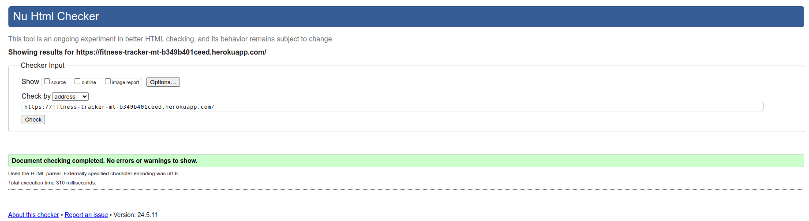
    

    Next, the validation was performed by 'Direct Input' by passing the page source. The templates (activity, nutrition and profile) showed some errors all related to one element - the SVG figure. Since this error did not affect how the figure is displayed and does not interact with other elements on the page, it was not handled.

    

    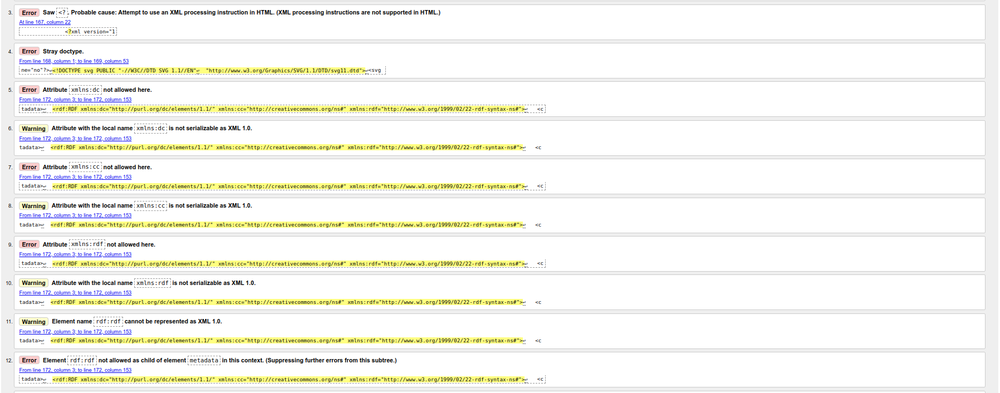
    

    * For the index and calendar templates, an error was raised from the iframe element. The styling of the iframe width and height was also performed from the CSS file but it was ignored. So it was left within the html file. The errors do not affect how the template is displayed.

    

    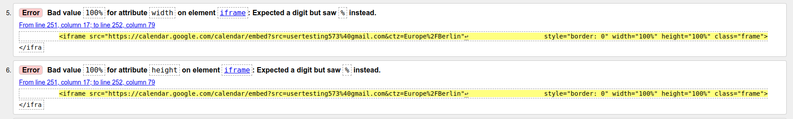
    

The aforementioned errors and warnings do not affect the functionality of the website by any means.

* [CSS Validator](https://jigsaw.w3.org/css-validator/) result for the `.css` file showed no errors, however it showed 4 warnings related to the importing of google fonts and using vendor extensions. These warnings do not affect the deployment of the website by any means

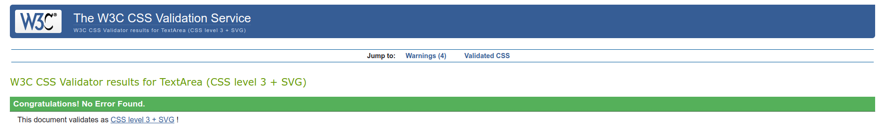

    

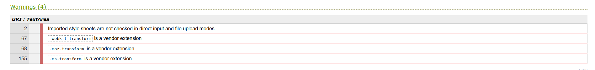

* [JavaScript Validator](https://jshint.com/) result for the `.js` file showed no errors, however it showed 1 warning and 1 unused variable. The warning does not affect the logic handling, data structure or flow control of the script. The unused variable is in fact an event handler function that fetched data from the calories API when user types in an activity or a meal.

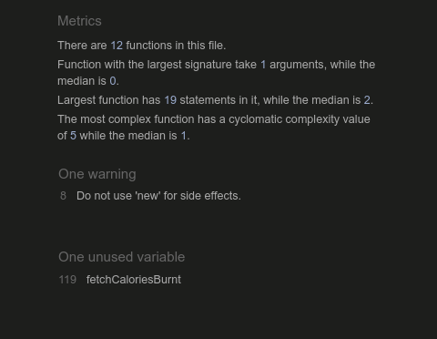

* [JSON Validator](https://jsonlint.com/) showed that the JSON files used in the fixtures are valid

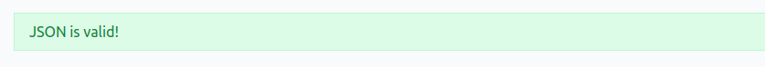

* [Python PEP8 CI Linter](https://pep8ci.herokuapp.com/) was used to check all python scripts. All clear, no errors found!

### Browser Compatibility

* Testing has been carried out on the following browsers :
    * Chrome 123.0.6312.86 (Official Build) (64-bit)
    * Chrome 123.0.6312.99
    * Firefox 124.0.1 (64-bit) 

### Accessibility and performance

These tests were carried out using Lighthouse

`index.html`

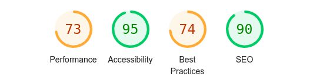

Dashboard

`profile.html`

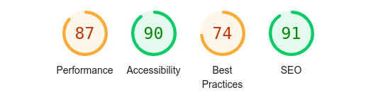

`activity.html`

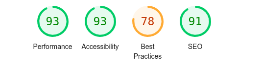

`nutrition.html`

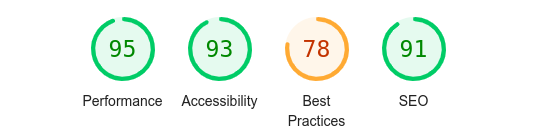

The website scores very high on accessibility, best practices and search engine optimization. Performance can still be improved on the index and dashboard pages.

### Test Cases and Results

The following test cases were performed on each page

* Home page (Unauthorized)

| Feature | Expected Outcome | Testing Performed | Result | Pass/Fail |
| --- | --- | --- | --- | --- |
| Button hover | button background color changes to reflect hover | mouse hover | button background color changes | Pass |
| Navbar items hover | navbar text and icon become darker to reflect hover  | mouse hover | navbar item color changes | Pass |
| Navbar toggle and burger icon | for small displays the burger icon is displayed | open homepage on small display | burger icon appears instead of navbar | Pass |
| Login | user is redireced to login page when login is pressed  | mouse click | user is redirected to login page | Pass |
| Signup | user is redireced to signup page when signup or "Get started" or "try it now" buttons are pressed  | mouse click | user is redirected to signup page | Pass |

* Signup page

| Feature | Expected Outcome | Testing Performed | Result | Pass/Fail |
| --- | --- | --- | --- | --- |
| Required fields | user should get notified if they skip required field | submit empty form | "Please fill out this field" pops up | Pass |
| Invalid field | user should get notified if there input is invalid  | enter invalid email address | "missing @ in address" pops up | Pass |
| Invalid field | user should get notified if there input is invalid  | enter invalid email address | "missing @ in address" pops up | Pass |
| Different passwords | user should get notified if they submit different passwords | enter different passwords | "You must type the same password each time." pops up | Pass |

* Login page

| Feature | Expected Outcome | Testing Performed | Result | Pass/Fail |
| --- | --- | --- | --- | --- |
| Required fields | user should get notified if they skip required field | submit empty form | "Please fill out this field" pops up | Pass |
| Non-existing user | user should get notified if the do not have an account | login with a new username | "The username and/or password you specified are not correct." pops up | Pass |

* Create profile page

| Feature | Expected Outcome | Testing Performed | Result | Pass/Fail |
| --- | --- | --- | --- | --- |
| Auto redirect after signup | user is redirected to the create profile page after signup | perform signup | gets redirected to create profile page | Pass |
| No data unless user creates profile | new user get '--' for their metric values | open create profile page | None values are displayed with '--' | Pass |
| Create profile | new user can create their profile when they press the button | click on create profile | form opens | Pass |
| Avoid alphabetical values | user should not be able to input letters in numeric fields | enter letters in numeric fields | field does not get updated | Pass |
| Avoid numerical values | user should not be able to input numbers in alphabetical fields | enter numbers in alphabetical fields | values set to default and user is shown an error message | Pass |
| Birth date from a date picker | user can input birth date by choosing by selection from a date picker | press on date field | datepicker opens up | Pass |

* Dashboard page 

| Feature | Expected Outcome | Testing Performed | Result | Pass/Fail |
| --- | --- | --- | --- | --- |
| Display metrics | user is shown their last weight and target weight entries | mouse click on Home or dashboard | last input metrics are shown | Pass |
| Display calorie burnt counter | user is shown their burnt calories according to their last activity and duration | enter activity and duration | calories burnt counter is updated | Pass |
| Display calorie intake counter | user is shown their intake calories according to their last meal and serving size | enter meal and serving | calories intake counter is updated | Pass |
| Delete last entry | user can delete their last activity/nutrition/metric profile entry | press delete button | message of entry deleted shows up | Pass |
| Avoid deleting first entry | user can not delete their initial entry | press delete button after creating first entry | 'You can not delete your first entry' shows up | Pass |
| Sidebar items navigation | user gets directed to the corresponding page for details on a certain card | press sidebar item | user gets navigated to the corresponding page | Pass |
| View details/History | user gets directed to the corresponding page for details on a certain card | press button | user gets navigated to the corresponding page | Pass |

* Profile page

| Feature | Expected Outcome | Testing Performed | Result | Pass/Fail |
| --- | --- | --- | --- | --- |
| Age from birth date | user's age is calculated from their input birth date | press button | user gets navigated to the corresponding page | Pass |
| Update profile | user can update their birth date or height | press button | a form opens up to input or upload data | Pass |
| Height value changes metrics | user's input height affects their BMI and BMR | update height | user gets new BMI and BMR values | Pass |
| Upload profile image | user can upload a profile image | upload image | it shows up as a profile image in side bar and on profile page | Pass |

* Activity and Nutrition pages

| Feature | Expected Outcome | Testing Performed | Result | Pass/Fail |
| --- | --- | --- | --- | --- |
| Display last entry | user can see their last logged entry | go to page | last entry shows | Pass |
| Display plot | user can keep a visual track of their past entries | go to page | a plot shows | Pass |
| Update plot | plots stay up-to-date by appending data points to the plot | add entry from dashboard | plot gets updated by last entry | Pass |

* Calendar page

| Feature | Expected Outcome | Testing Performed | Result | Pass/Fail |
| --- | --- | --- | --- | --- |
| Display calendar iframe | user can see their calendar events | go to calendar page | calendar shows | Pass |

### Known Bugs

* The website depends on *Font Awesome* package. If *Font Awesome* is down, the icons do not load and so the footer would not look as intended. The icons next to quiz page headers also will not load. This was encountered once when *Font Awesome* was having major issues.

* In medium and small displays, the SVG figure used for plotting does not fit within the `div` element. I have tried styling the element and its container in the CSS file but it ignores the values I specify. The workaround is to specify the `figsize` attribute in the matplotib plot object, however, the figure becomes small for large displays.

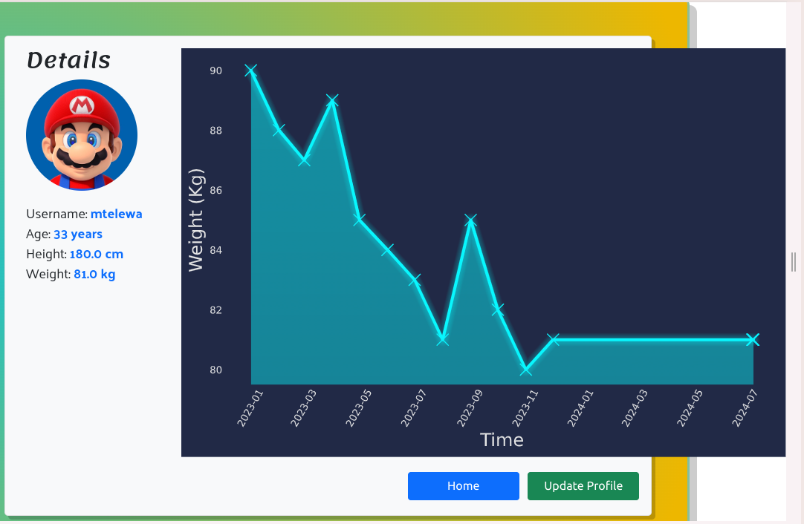

* On the logout page, the profile image disappears. This is because the profile image is not passed as a variable to the `logout` template.

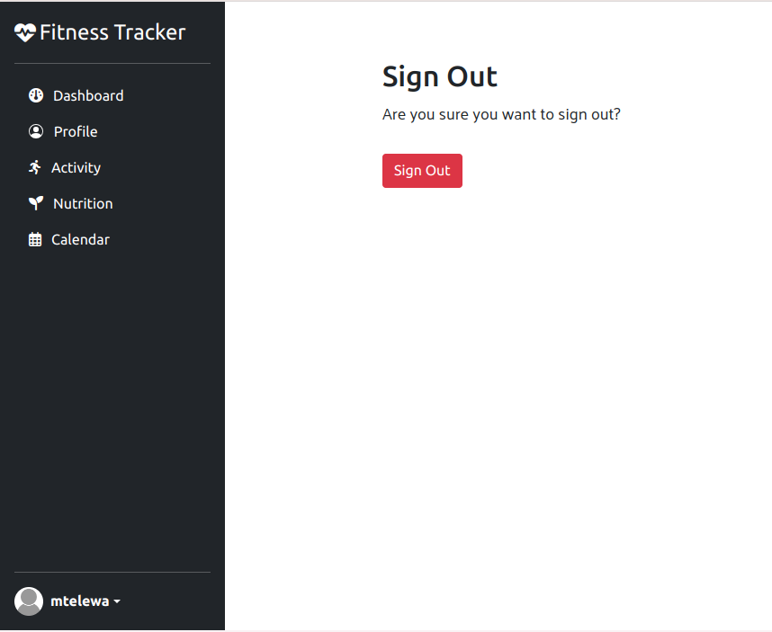

* On login page, the `forgot password` link leads to a password reset template. When the user fills in the email and clicks on `Reset My Password`, A Server Error (500) is obtained. This is simply because the reset password was not managed in this project.

* Updating any form field on the profile page (like birth date or height or uploading image) will add another point on the weight plot as it counts as another profile entry which is appended to the plot. This could be circumvented by separating the profile custom model from the user's metrics.